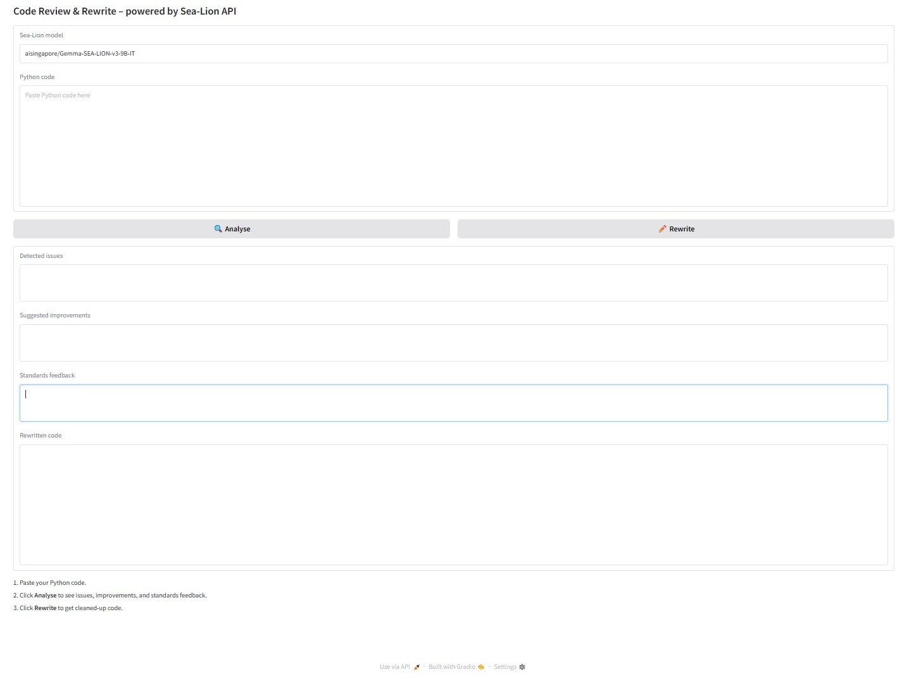

# 🦭 Sea-Lion Code-Review & Rewrite Tool

# [code-enhancer.onrender.com](https://code-enhancer.onrender.com)


A **one-click code reviewer** that spots bugs, suggests improvements, checks PEP 8 compliance — and can rewrite your Python file for you.  
Powered entirely by the **SEA-LION hosted LLM API** (no GPU, no Docker, no local weights) and wrapped in a clean Gradio UI that runs happily on Render’s free tier.

<p align="center">
  
</p>

---

## ✨ Why is this useful?

| Pain point | How the app helps |
|------------|------------------|
| **Code reviews are slow** when teammates are busy | Get an instant, always-on reviewer that explains *why* something is wrong, not just *that* it’s wrong |
| **Local LLMs are heavy** (Ollama, GPU, RAM) | Uses a lightweight HTTPS call to SEA-LION’s 9 B IT model – zero hardware overhead |
| **PEP 8 tools don’t rewrite** | After analysing, click **Rewrite** to receive a fully refactored version obeying every suggestion |
| **Deploying AI demos is fiddly** | Render button + free tier → live URL in under 3 minutes |

---

## 🏗️ How it works

1. **Gradio front-end** collects your Python snippet.  
2. Four prompts are sent to SEA-LION via its `/v1/chat/completions` endpoint:  
   * _Bug Finder_ · _Improvement Guru_ · _Standards Inspector_ · _Rewriter_.  
3. Responses stream back and populate the UI.  
4. **Rewrite** stitches all findings into one final prompt and returns *only* the rewritten code.

All API calls are HTTPS; your code never leaves the SEA-LION inference servers.

---

## 🚀 Quick start (local)

```bash
git clone https://github.com/you/sea-lion-code-review.git
cd sea-lion-code-review
echo "SEA_LION_API_KEY=sk-…" > .env
pip install -r requirements.txt              # or: pip install -U gradio fastapi ...
python main.py                               # open http://localhost:7860
Codespaces? Open a new Codespace and run the same commands – the port is forwarded automatically.

☁️ 1-click deploy (Render)
Fork the repo.

Click New ▸ Web Service on Render and point it to your fork.

Add SEA_LION_API_KEY in the Environment tab.

Hit Create – done!
(Render reads render.yaml, installs deps, and serves on https://<app>.onrender.com.)

🔍 Features
Bug detection – syntax, logic, edge cases.

Improvement suggestions – performance, readability, naming, memory.

PEP 8 & design checks – formatting, docstrings, error handling.

One-click rewrite – merges every finding into a clean code block.

Model picker – UI textbox lets you try any SEA-LION-hosted model.

100 % stateless – no DB; perfect for free dynos that spin down.

🛠️ Tech stack
Layer	Tech
UI	Gradio 4
Backend	FastAPI 0.109 (Pydantic 1) <!-- or 0.111/Pydantic 2 if you upgraded -->
LLM API	SEA-LION aisingapore/Gemma-SEA-LION-v3-9B-IT
Hosting	Render free tier

🗺️ Roadmap
 Multi-file uploads (zip / GitHub repo URL)

 TypeScript & Go language support

 Inline diff view (monaco-editor)

 CI bot that comments on PRs

🤝 Contributing
Pull requests are welcome!
Please open an issue first to discuss big changes.
Make sure pre-commit run --all-files passes.

⚖️ License
MIT – do anything you want, but don’t blame me if it breaks.

Built with ❤️ in Singapore!
